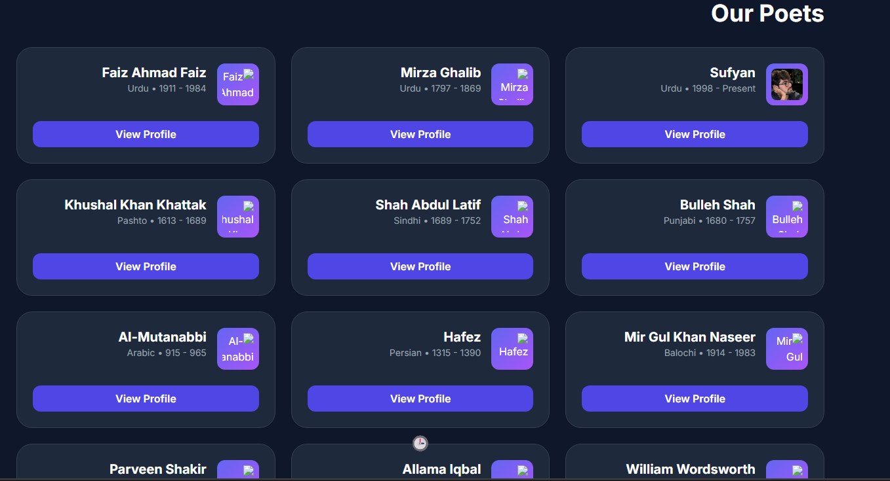
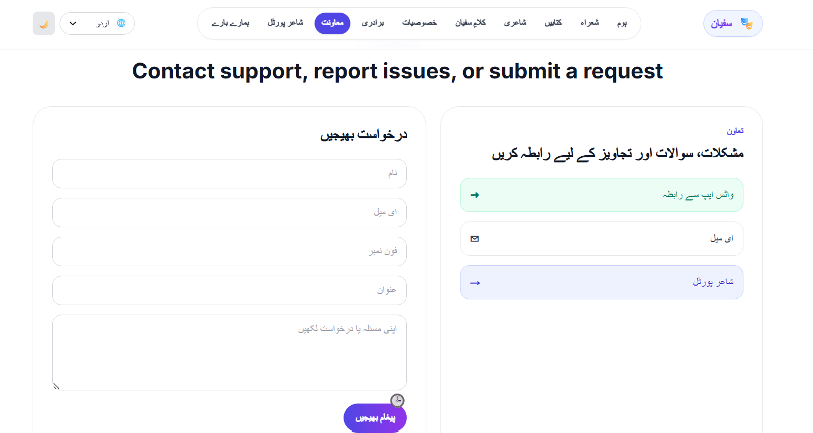
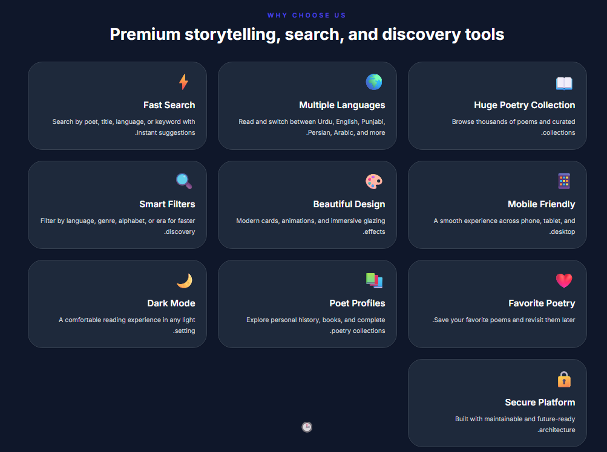
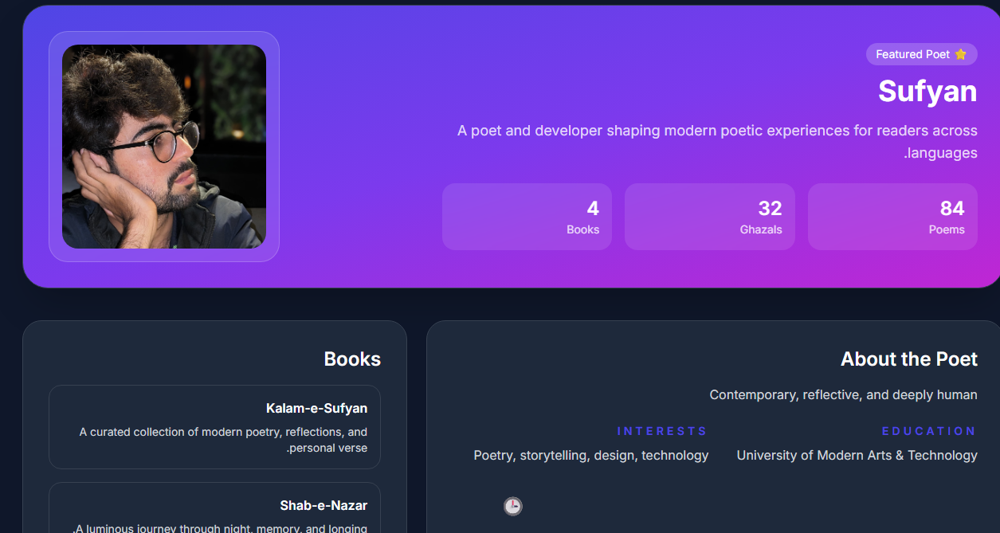

# 🎭 Ahl-e-Sukhan

## Urdu Poetry Platform

Ahl-e-Sukhan is a modern Urdu poetry platform designed for poetry lovers, readers, and writers. The project focuses on providing an elegant reading experience with a clean interface and modern web technologies.

---

# Live Demo

🔗 https://poetrywithsufyan.vercel.app/

---

# Project Overview

Ahl-e-Sukhan provides:

- Poetry Reading
- Poetry Search
- Poet Profiles
- Responsive Design
- Dark Mode
- Urdu Interface
- Community Features
- Beautiful User Experience

---

# Technology Stack

- Next.js
- React
- TypeScript
- Tailwind CSS
- Framer Motion

---

# ScrenShots

## Home

---

## Poets

---

## Supports

---

## Poet Portel

---

## Features

---

## Author

---

# Demo Video

A complete walkthrough video is available inside the **demo** folder.

---

# Features

- Beautiful UI
- Responsive Layout
- Modern Animations
- Urdu Support
- Advanced Search
- Community Ready
- Performance Optimized

---

# Repository Notice

This repository is intended for portfolio demonstration purposes only.

The production source code remains private.

---

© 2026 Sufyan